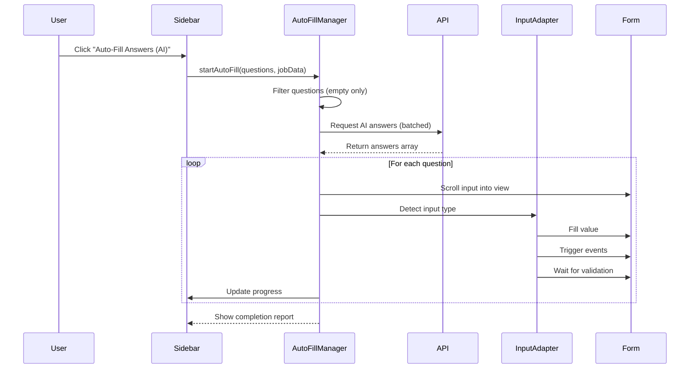

# Auto-Fill Feature Documentation

## Overview

The Auto-Fill feature uses AI-generated responses to automatically populate detected questions in job application forms. This document describes the feature's behavior, edge cases, and implementation details.

---

## Feature Behavior

### Activation Flow



### 1. **Question Filtering**

**Behavior:**
- Only processes questions that are completely empty (no answer at all)
- Skips questions that already have any answer (even partial)
- Notifies user if all questions already have answers

**Why:**
Users may have started filling questions manually. Auto-fill should only populate empty fields to avoid overwriting user input.

### 2. **Batched API Requests**

**Behavior:**
- Sends all questions in a single batch request for efficiency
- Falls back to individual requests if batch fails
- Includes job description as context for better AI responses

**Endpoint:**
```javascript
POST /api/auto-fill/answers/batch
{
  userId: string,
  questions: string[], // Array of question texts
  jobDescription: string
}

Response: {
  answers: string[] // Ordered array matching questions
}
```

### 3. **Progressive Filling**

**Behavior:**
- Processes questions sequentially (one at a time)
- Scrolls each input into view before filling
- Waits 300ms between fills to avoid overwhelming the page
- Updates progress bar in real-time
- Allows cancellation at any point

**Progress Updates:**
```javascript
{
  percentage: 0-100,
  currentQuestion: number,
  totalQuestions: number,
  message: string
}
```

### 4. **Input Type Detection**

**Priority Order:**
1. WYSIWYG editors (TinyMCE, Quill, CKEditor, Froala)
2. ContentEditable elements
3. React inputs (synthetic events)
4. Vue inputs (v-model)
5. Select dropdowns
6. Standard inputs/textareas

**Detection Logic:**
```javascript
// WYSIWYG: Check for editor classes
if (element.className.includes('tox-') || 
    element.className.includes('ql-editor')) {
  return 'wysiwyg';
}

// ContentEditable
if (element.contentEditable === 'true') {
  return 'contentEditable';
}

// React: Check for React fiber
if (Object.keys(element).some(k => k.startsWith('__react'))) {
  return 'react';
}

// Vue: Check for Vue instance
if (element.__vue__ || element.__vnode) {
  return 'vue';
}
```

### 5. **Event Triggering**

**Event Sequence:**
```javascript
1. focusin
2. focus
3. keydown (simulated typing)
4. input (with inputType: 'insertText')
5. keyup
6. change
7. [Framework-specific events]
8. blur
9. focusout
```

**Why This Matters:**
Many forms have validation logic that only triggers on specific events. We trigger all possible events to ensure compatibility.

### 6. **Validation Waiting**

**Behavior:**
- Waits up to 500ms for form validation to complete
- Checks for error indicators every 50ms
- Looks for common error classes/attributes:
  - `.error`, `.invalid`, `.is-invalid`
  - Error message elements
  - `validity.valid` attribute

### 7. **Value Verification**

**Behavior:**
- Verifies value was actually set after filling
- Compares actual vs expected value
- Considers fill successful if ≥80% of expected value is present
- Logs failures for debugging

**Why 80%:**
Some forms may trim whitespace or apply formatting, so we allow slight differences.

---

## Edge Cases & Handling

### 1. **Input Element Removed from DOM**

**Scenario:** Form structure changes while auto-fill is running (SPA navigation, dynamic forms)

**Handling:**
```javascript
if (!inputElement || !document.body.contains(inputElement)) {
  result.error = 'Input element not found or removed from DOM';
  return result;
}
```

**Outcome:** Skips that question, continues with others

---

### 2. **React Controlled Inputs**

**Scenario:** React forms using controlled components don't respond to standard `element.value = x`

**Handling:**
```javascript
// Use native setter to bypass React's control
const nativeInputValueSetter = Object.getOwnPropertyDescriptor(
  window.HTMLInputElement.prototype,
  'value'
).set;

nativeInputValueSetter.call(element, value);

// Trigger React synthetic events
const inputEvent = new Event('input', { bubbles: true });
element.dispatchEvent(inputEvent);
```

**Why:** React overrides native setters. We access the native setter directly.

---

### 3. **Vue v-model Bindings**

**Scenario:** Vue forms using v-model don't update when value is set directly

**Handling:**
```javascript
// Set value
element.value = value;

// Emit Vue events
if (element.__vue__) {
  element.__vue__.$emit('input', value);
  element.__vue__.$emit('change', value);
}

// Also dispatch native events as fallback
element.dispatchEvent(new Event('input', { bubbles: true }));
```

---

### 4. **WYSIWYG Editors**

**Scenario:** Rich text editors (TinyMCE, Quill) have custom APIs

**Handling:**
```javascript
// TinyMCE
if (window.tinymce) {
  const editor = tinymce.get(element.id);
  if (editor) {
    editor.setContent(value);
    return { success: true };
  }
}

// Quill
if (element.__quill) {
  element.__quill.setText(value);
  return { success: true };
}

// Fallback to contentEditable
const editableElement = findContentEditableElement(element);
if (editableElement) {
  editableElement.textContent = value;
}
```

**Why:** Each editor has its own API. We try the API first, then fall back to contentEditable.

---

### 5. **Form Validation Errors**

**Scenario:** AI generates invalid answer (too short, wrong format, etc.)

**Handling:**
```javascript
// Wait for validation
await waitForValidation(element, 500);

// Check for errors
const hasErrorClass = element.classList.contains('error');
const hasErrorSibling = parent.querySelector('.error-message');

if (hasErrorClass || hasErrorSibling) {
  // Log but continue (user can fix manually)
  console.warn('Validation error detected for question:', questionId);
}
```

**Outcome:** Continues filling other questions. User can manually correct invalid answers.

---

### 6. **API Request Failures**

**Scenario:** Backend API is down or returns error

**Handling:**
```javascript
try {
  const response = await chrome.runtime.sendMessage({
    type: 'AUTO_FILL_GET_ANSWERS_BATCH',
    data: { userId, questions, jobDescription }
  });

  if (!response.success) {
    throw new Error(response.error);
  }
} catch (error) {
  return {
    success: false,
    error: 'Failed to get AI answers: ' + error.message
  };
}
```

**Outcome:** Shows error message, no questions filled

---

### 7. **User Authentication Missing**

**Scenario:** User is not authenticated or token is expired

**Handling:**
```javascript
const userId = await this.getUserId();
if (!userId) {
  return this.handleError('User not authenticated');
}
```

**Outcome:** Shows error message, prompts user to log in

---

### 8. **Mid-Process Cancellation**

**Scenario:** User clicks "Cancel" while auto-fill is running

**Handling:**
```javascript
// In main loop
if (this.cancelRequested) {
  console.log('Auto-fill cancelled by user');
  break;
}

// Cancel method
cancel() {
  this.cancelRequested = true;
  this.updateProgress(100, 'Auto-fill cancelled');
}
```

**Outcome:** Stops immediately, questions already filled remain filled

---

### 9. **Questions with No Input Element**

**Scenario:** Question was detected but input element is no longer accessible

**Handling:**
```javascript
const questionsWithInputs = questions.filter(q => q.inputElement);

if (questionsWithInputs.length === 0) {
  return { 
    valid: false, 
    error: 'No input elements found for questions' 
  };
}
```

**Outcome:** Only processes questions with valid input elements

---

### 10. **Multiple Fills in Rapid Succession**

**Scenario:** User clicks auto-fill button multiple times

**Handling:**
```javascript
if (this.isRunning) {
  console.warn('Auto-fill already in progress');
  return { success: false, error: 'Auto-fill already running' };
}

this.isRunning = true;
// ... fill process ...
this.isRunning = false;
```

**Outcome:** Second click is ignored until first completes

---

### 11. **Shadow DOM Elements**

**Scenario:** Form inputs inside Shadow DOM (Web Components)

**Handling:**
```javascript
// Current implementation doesn't handle Shadow DOM
// Questions inside Shadow DOM won't be detected by DataCollector
```

**Limitation:** Shadow DOM inputs are not supported in v1.0

**Workaround:** None currently. Would require Shadow DOM traversal in DataCollector.

---

### 12. **iFrame Forms**

**Scenario:** Application form is inside an iframe

**Handling:**
```javascript
// Content scripts don't inject into iframes by default
```

**Limitation:** iFrame forms are not supported

**Workaround:** Would require `all_frames: true` in manifest and cross-origin handling

---

### 13. **Character Limit Exceeded**

**Scenario:** AI generates answer longer than input's maxLength

**Handling:**
```javascript
// Browser automatically truncates at maxLength
element.value = longValue; // Browser handles truncation
```

**Outcome:** Answer is automatically truncated to maxLength. User sees truncated version.

---

### 14. **Multi-Step Forms**

**Scenario:** Questions span multiple pages/steps

**Handling:**
```javascript
// Questions are detected per-page
// Auto-fill only fills questions on current page
```

**Behavior:** User must navigate to next step, then run auto-fill again

---

### 15. **Select Dropdowns**

**Scenario:** Question is a dropdown menu, not a text field

**Handling:**
```javascript
// Find matching option by text
const matchingOption = options.find(opt => 
  opt.text.toLowerCase().includes(value.toLowerCase())
);

if (matchingOption) {
  element.value = matchingOption.value;
  element.dispatchEvent(new Event('change'));
}
```

**Limitation:** May not find exact match for generated text

**Fallback:** Marks as failed, user selects manually

---

### 16. **Required Fields Validation**

**Scenario:** Form prevents submission if required fields are empty

**Handling:**
```javascript
// Auto-fill respects all detected questions
// If a required field wasn't detected as a question, it won't be filled
```

**Mitigation:** DataCollector uses broad detection patterns to catch most questions

---

### 17. **Duplicate Questions**

**Scenario:** Same question appears multiple times on page

**Handling:**
```javascript
// Each question gets unique ID based on text hash
generateQuestionId(text) {
  let hash = 0;
  for (let i = 0; i < text.length; i++) {
    const char = text.charCodeAt(i);
    hash = ((hash << 5) - hash) + char;
  }
  return Math.abs(hash).toString();
}
```

**Outcome:** Each instance is treated as separate question and filled independently

---

### 18. **Dynamic Form Fields**

**Scenario:** Form adds new fields after auto-fill completes

**Handling:**
```javascript
// DataCollector continuously monitors for new questions
// But auto-fill only processes questions present when button is clicked
```

**Workaround:** User can run auto-fill again for newly appeared questions

---

### 19. **API Response Mismatch**

**Scenario:** API returns fewer/more answers than questions sent

**Handling:**
```javascript
// Array index matching
for (let i = 0; i < questionsToFill.length; i++) {
  const answer = answers.data[i];
  if (!answer) {
    console.warn('No answer for question:', questionsToFill[i].text);
    continue;
  }
  // Fill question
}
```

**Outcome:** Questions without matching answers are skipped

---

### 20. **Special Characters in Answers**

**Scenario:** AI generates answer with HTML entities or special characters

**Handling:**
```javascript
// Set value as-is, browser handles encoding
element.value = answer; // "<>&" handled by browser
```

**Outcome:** Browser automatically handles HTML encoding for input values

---

## Performance Considerations

### Memory

**Question Storage:**
- Questions stored in Map: O(1) lookup
- Typical memory: ~1KB per question
- Max expected: ~50 questions = 50KB

**API Responses:**
- Cached in closure during fill process
- Cleared after completion
- No persistent storage

### Network

**Batch Request Size:**
```javascript
// Typical payload
{
  userId: "12345",
  questions: [
    "Why do you want this role?",
    "Describe your experience...",
    // ... ~10-20 questions
  ],
  jobDescription: "..." // ~1-5KB
}

// Estimated size: 5-15KB
```

**API Calls:**
- 1 batch request per auto-fill (not per question)
- Reduces API calls by 10-20x vs individual requests

### UI Responsiveness

**Delays:**
- 50ms after focus/blur events
- 300ms between question fills
- Up to 500ms waiting for validation

**Why Delays:**
- Allows DOM updates to complete
- Prevents race conditions
- Ensures form validation triggers

---

## Error Reporting

### Success Report

```javascript
{
  success: true,
  filled: 8,        // Successfully filled
  skipped: 2,       // Already had answers
  failed: 0,        // Errors
  cancelled: false,
  message: "Filled 8 of 10 questions.",
  details: [...]    // Per-question results
}
```

### Failure Report

```javascript
{
  success: false,
  filled: 0,
  skipped: 0,
  failed: 10,
  error: "No authentication token available",
  details: []
}
```

### Partial Success

```javascript
{
  success: true,
  filled: 6,
  skipped: 0,
  failed: 4,
  message: "Filled 6 of 10 questions.",
  details: [
    { questionId: "q1", success: true },
    { questionId: "q2", success: true },
    { questionId: "q3", success: false, error: "Input not found" },
    // ...
  ]
}
```

---

## Testing Scenarios

### Manual Testing Checklist

- [ ] Standard text inputs
- [ ] Textarea elements
- [ ] React form (e.g., LinkedIn)
- [ ] Vue form (e.g., WhiteCarrot)
- [ ] WYSIWYG editor
- [ ] ContentEditable div
- [ ] Select dropdown
- [ ] Multi-step form
- [ ] Form with validation
- [ ] Form with character limits
- [ ] Cancel mid-process
- [ ] Run twice consecutively
- [ ] API failure scenario
- [ ] Unauthenticated user
- [ ] No questions detected
- [ ] All questions already answered

---

## Future Improvements

### Planned Enhancements

1. **Shadow DOM Support**
   - Traverse Shadow DOM in DataCollector
   - Fill inputs inside Web Components

2. **iFrame Support**
   - Enable `all_frames: true` in manifest
   - Handle cross-origin iframes

3. **Smart Retry**
   - Retry failed questions automatically
   - Use different filling strategy on retry

4. **Answer Caching**
   - Cache AI responses locally
   - Reuse for similar questions

5. **Confidence Scoring**
   - AI returns confidence score per answer
   - Only fill if confidence > threshold

6. **Answer Preview**
   - Show answers before filling
   - Let user edit/approve before application

7. **Undo Functionality**
   - Store original values before fill
   - Allow reverting to original state

8. **Progress Persistence**
   - Save progress if page refreshes
   - Resume from where it left off

---

## Troubleshooting

### "Auto-fill system not initialized"

**Cause:** AutoFillManager didn't load properly

**Solution:** Rebuild extension and reload

---

### "No questions detected to fill"

**Cause:** DataCollector didn't detect any questions

**Solution:** 
- Ensure application form is visible
- Check browser console for detection logs
- Questions must have identifiable labels

---

### "User not authenticated"

**Cause:** No valid JWT token available

**Solution:** Log in to Job Lander frontend app

---

### "Failed to get AI answers"

**Cause:** Backend API unavailable or returned error

**Solution:**
- Check backend API is running
- Verify endpoint `/api/auto-fill/answers/batch` exists
- Check network tab for error details

---

### Values not sticking in form

**Cause:** Events not triggering properly for specific input type

**Solution:**
- Check console for input type detection
- May need custom adapter for that specific form framework

---

### Validation errors after fill

**Cause:** AI generated invalid content

**Solution:** User must manually correct the invalid answers

---

## Security Considerations

### Data Privacy

**What's Sent to API:**
- User ID
- Question texts
- Job description

**What's NOT Sent:**
- User's actual answers
- Personal information from other form fields
- Browser history or cookies

### API Authentication

**All requests include:**
- JWT Bearer token
- Token validated on backend
- Expired tokens automatically refreshed

### XSS Prevention

**Input sanitization:**
- No sanitization needed (browser handles HTML encoding)
- Values set via `.value` property (safe)
- No `innerHTML` used

---

## Conclusion

The Auto-Fill feature is designed to be **robust**, **efficient**, and **user-friendly**. It handles the majority of edge cases gracefully and provides clear feedback when issues occur. The modular adapter pattern makes it easy to add support for new input types in the future.

**Key Strengths:**
- ✅ Broad compatibility (React, Vue, WYSIWYG)
- ✅ Efficient (batched API requests)
- ✅ Safe (no data loss, cancellable)
- ✅ Transparent (clear progress and error reporting)

**Known Limitations:**
- ❌ No Shadow DOM support (yet)
- ❌ No iFrame support (yet)
- ❌ Cannot correct validation errors automatically

For questions or issues, refer to the console logs (prefix: "Job Lander:") for detailed debugging information.
