# 🚀 Job Lander Browser Extension

> A sophisticated Chrome extension that automates job application tracking by intelligently capturing data from job postings and syncing it with the Job Lander platform.

[](https://github.com/your-repo)
[](LICENSE)
[](https://chrome.google.com/webstore)

---

## 📋 Table of Contents

- [Overview](#-overview)
- [Architecture](#-architecture)
- [Key Features](#-key-features)
- [Installation & Setup](#-installation--setup)
- [User Guide](#-user-guide)
- [Technical Details](#-technical-details)
- [Development](#-development)
- [Troubleshooting](#-troubleshooting)
- [Contributing](#-contributing)

---

## 🎯 Overview

The Job Lander Browser Extension is an intelligent automation tool designed to streamline the job application tracking process. It eliminates manual data entry by automatically extracting job details from posting pages, detecting interview questions as users fill out application forms, and syncing everything to the Job Lander platform in real-time.

### Problem Statement

Job seekers often struggle with:
- **Manual data entry**: Copying job details from postings to tracking spreadsheets
- **Lost information**: Forgetting which questions were asked during applications
- **Time waste**: Spending minutes on each application just for record-keeping
- **Inconsistent tracking**: Missing details or forgetting to log applications

### Solution

Our extension provides:
- ✅ **Automated data capture** from 95%+ of job sites
- ✅ **Real-time question detection** as you fill out forms
- ✅ **One-click application saving** with all metadata
- ✅ **Seamless sync** with your Job Lander dashboard
- ✅ **Progressive tracking** that adapts to any application workflow

---

## 🏗️ Architecture

### High-Level System Architecture


### Component Interaction Flow


---

## ✨ Key Features

### 1. **Intelligent Multi-Strategy Job Data Extraction**

The extension uses a sophisticated **cascading fallback strategy** to ensure maximum compatibility across job sites:


**Supported Platforms**:
- ✅ **LinkedIn Jobs** - Full support with location detection
- ✅ **Indeed** - All variants and country sites
- ✅ **Glassdoor** - Two-column layout handling
- ✅ **WhiteCarrot** - Vue.js SPA support
- ✅ **Greenhouse** - Full ATS integration
- ✅ **Lever** - Complete ATS support
- ✅ **Workday** - myworkdayjobs.com sites
- ✅ **Ashby** - Modern ATS platform
- ✅ **SmartRecruiters** - Full coverage
- ✅ **95%+ of custom career pages** - Universal fallback

### 2. **Progressive Application Tracking**

The extension adapts to multi-step application processes:


### 3. **Smart Question Detection**

Automatically identifies and captures interview questions with intelligent filtering:

- ✅ **Minimum length**: Only saves answers ≥100 characters
- ✅ **Real-time status**: Color-coded UI feedback (green = will save, yellow = too short)
- ✅ **Manual addition**: Users can add custom questions
- ✅ **Live editing**: Questions and answers editable in sidebar
- ✅ **Smart filtering**: Excludes name/email/phone fields

### 4. **Interactive Sidebar UI**

```mermaid
graph LR
    A[Sidebar] --> B[Header<br/>Draggable]
    A --> C[Job Details<br/>Editable Fields]
    A --> D[Dropdowns<br/>Company & CV]
    A --> E[Questions List<br/>Color-coded]
    A --> F[Footer<br/>Actions]
    
    B --> B1[Collapse/Expand]
    B --> B2[Drag Left/Right]
    
    E --> E1[Green = ≥100 chars]
    E --> E2[Yellow = 1-99 chars]
    E --> E3[Gray = Empty]
    
    F --> F1[Save Button]
    F --> F2[Cancel Button]
    
    style A fill:#7571f9,color:#fff
    style B fill:#667eea,color:#fff
    style E fill:#764ba2,color:#fff
```



**UX Features**:
- 🎯 **Collapsible**: Minimize to header-only view
- 🎯 **Draggable**: Move between left and right screen edges
- 🎯 **Non-intrusive**: Stays on top, doesn't block page content
- 🎯 **Real-time updates**: Instant feedback on all changes

### 5. **Popup Dashboard**

The extension popup provides quick access to:

- 📊 **Statistics**: Total applications, pending, interviews, offers
- 📋 **Recent Applications**: Last 5 applications with status
- 🎯 **Weekly Goals**: Set and track application targets
- 🔍 **Quick Search**: One-click access to job boards
- 👤 **User Profile**: Personalized welcome with user's first name

---

## 🛠️ Installation & Setup

### Prerequisites

| Requirement | Version | Purpose |
|-------------|---------|---------|
| Node.js | ≥16.0.0 | Build toolchain |
| npm | ≥8.0.0 | Package management |
| Chrome | ≥90 | Extension runtime |
| Job Lander Account | Active | Authentication |

### Step 1: Install Dependencies

```bash
cd job-lander-extension
npm install
```

**Dependencies installed**:
- React 18 (UI framework)
- TailwindCSS (Styling)
- Webpack 5 (Bundler)
- Babel (Transpiler)
- date-fns (Date utilities)
- lucide-react (Icons)

### Step 2: Configure API Endpoints

Update the backend URL in `utils/auth.js`:

```javascript
const API_BASE_URL = 'https://your-backend-url.com/api'; // Update this
```

Update the frontend URL in `src/components/LoginForm.jsx` and `src/components/Dashboard.jsx`:

```javascript
const FRONTEND_URL = 'https://your-frontend-url.com'; // Update this
```

### Step 3: Build the Extension

```bash
npm run build
```

**Build outputs**:
- `dist/popup.js` - Popup UI bundle
- `dist/styles.css` - Compiled Tailwind styles
- `dist/background.js` - Service worker
- `content-scripts/` - Injected scripts (copied as-is)

### Step 4: Load in Chrome

1. Open Chrome and navigate to `chrome://extensions/`
2. Enable **Developer mode** (toggle in top-right)
3. Click **"Load unpacked"**
4. Select the `job-lander-extension` folder
5. The extension icon should appear in your toolbar

### Step 5: Authenticate

1. Click the extension icon
2. Sign in with your Job Lander credentials
3. The extension will automatically sync with your account

---

## 📖 User Guide

### First-Time Setup


### Tracking a Job Application

#### Step-by-Step Workflow

1. **Navigate to a job posting** (any supported site)
2. **Click "Start Tracking Application"** button (appears on job pages)
3. **Review extracted job details** in the sidebar
4. **Select company and CV** from dropdowns (required)
5. **Fill out the application** as normal
6. **Watch questions appear** in real-time (answers ≥100 chars shown in green)
7. **Edit any details** if needed (job title, description, questions)
8. **Click "Save Application"** when ready
9. **Receive confirmation** notification

#### Visual Example

```
┌─────────────────────────────────────────────────────────────┐
│  Job Site Page                                     Sidebar   │
│  ┌─────────────────────────┐              ┌──────────────┐  │
│  │  Software Engineer      │              │  Job Details │  │
│  │  Company XYZ            │  ───────────>│  ✓ Extracted │  │
│  │  San Francisco, CA      │              │  ✓ Editable  │  │
│  │  [Apply Now]            │              │              │  │
│  └─────────────────────────┘              │  Questions   │  │
│                                            │  🟢 Q1 (150) │  │
│  ┌─────────────────────────┐              │  🟡 Q2 (50)  │  │
│  │  Application Form       │  ───────────>│              │  │
│  │  ┌───────────────────┐  │              │  [Save]      │  │
│  │  │ Why this role?    │  │              └──────────────┘  │
│  │  │ [Answer here...] │  │                                 │
│  │  └───────────────────┘  │                                 │
│  └─────────────────────────┘                                 │
└─────────────────────────────────────────────────────────────┘
```

### Using the Extension Popup

The popup has three tabs:

#### 📊 Overview Tab
- View application statistics (total, pending, interviews, offers)
- See your last 5 applications with status badges
- Quick link to full dashboard

#### 🔍 Quick Search Tab
- One-click access to:
  - LinkedIn Jobs
  - Indeed
  - Glassdoor
  - Monster
  - ZipRecruiter

#### 🎯 Goals Tab
- Set weekly application targets
- Track progress with visual progress bar
- View completion percentage
- Edit or delete goals

---

## 🔧 Technical Details

### Authentication Flow


### Data Flow Architecture


### Core Components

#### 1. **Page Detector** (`pageDetector.js`)

**Responsibility**: Monitor URL changes and detect page types

**Technologies**:
- MutationObserver (DOM changes)
- History API interception (SPA navigation)
- Event listeners (popstate, hashchange)

**Detected Page Types**:
- Job posting page
- Application form page
- Application complete page

```javascript
// Example: Detecting LinkedIn job postings
isJobPostingPage() {
  const url = window.location.href.toLowerCase();
  if (url.includes('linkedin.com/jobs/view')) return true;
  if (url.includes('ashbyhq.com')) return true;
  // ... more patterns
}
```

#### 2. **Job Data Extractor** (`jobDataExtractor.js`)

**Responsibility**: Extract job data using multiple strategies

**Extraction Strategies** (in order):

1. **JSON-LD**: `<script type="application/ld+json">` with schema.org
2. **Site-Specific**: Custom selectors for major sites
3. **Meta Tags**: OpenGraph and Twitter Card metadata
4. **Smart DOM**: Content scoring algorithm

**Key Methods**:
- `extract()` - Main entry point, tries all strategies
- `extractFromSiteSpecific()` - Platform-specific logic
- `findJobDescription()` - Scoring algorithm for descriptions
- `normalize()` - Standardize and truncate data (7000 chars)

**Special Features**:
- Smart truncation at word boundaries
- Location detection with scoring system (LinkedIn)
- Company name fallback (prevents "Glassdoor" as company)
- Salary pattern matching

#### 3. **Application Tracker** (`applicationTracker.js`)

**Responsibility**: Main orchestrator for tracking workflow

**Lifecycle**:
1. Initialize on page load
2. Show "Start Tracking" button on job pages
3. Extract initial job data
4. Fetch companies and CVs from backend
5. Display sidebar
6. Monitor form inputs for questions
7. Validate and save application

**Validation Rules**:
- Company and CV must be selected
- Job title and company name required
- Questions must have answers ≥100 characters

#### 4. **Sidebar Manager** (`sidebarManager.js`)

**Responsibility**: Manage sidebar UI and interactions

**Features**:
- Gradient purple header with drag handle
- Collapsible (header-only mode)
- Horizontal dragging (left ↔ right)
- Real-time question updates
- Color-coded status indicators
- Manual question addition

**CSS Positioning**:
```css
#job-lander-sidebar {
  position: fixed;
  z-index: 999998;
  transition: all 0.4s cubic-bezier(0.4, 0, 0.2, 1);
}

.jl-position-left { left: 0; }
.jl-position-right { right: 0; }
```

#### 5. **Data Collector** (`dataCollector.js`)

**Responsibility**: Detect questions and capture answers

**Detection Logic**:
- Scans for textareas and text inputs
- Filters out common fields (email, phone, name)
- Only stores answers ≥100 characters
- Uses MutationObserver for dynamic forms
- Debounces input events (500ms)

**Question Identification**:
```javascript
findQuestionText(element) {
  // Look for labels, legends, or nearby text
  const label = element.closest('label');
  const legend = element.closest('fieldset')?.querySelector('legend');
  // ... more heuristics
}
```

#### 6. **Background Service Worker** (`background.js`)

**Responsibility**: API communication and messaging hub

**Key Functions**:
- Token management (retrieve, validate, refresh)
- API request wrapper with authentication
- Message routing between popup and content scripts
- Notification management

**Supported Message Types**:
- `GET_COMPANIES` - Fetch user's companies
- `GET_CVS` - Fetch user's CVs
- `SAVE_TRACKED_APPLICATION` - Save application + questions
- `GET_USER_DATA` - Get authenticated user info
- `LOGOUT` - Clear authentication

#### 7. **Popup Dashboard** (`Dashboard.jsx`)

**Responsibility**: Extension popup UI

**Tabs**:
1. **Overview**: Stats cards, recent applications
2. **Quick Search**: Job board links
3. **Goals**: Weekly goal management with CRUD operations

**State Management**:
- React hooks (useState, useEffect)
- Local state for UI (tabs, forms)
- API calls through `apiManager`

**Goal Management**:
- Create: `POST /api/weekly-goals`
- Read: `GET /api/weekly-goals/stats`
- Update: `PUT /api/weekly-goals/{id}`
- Delete: `DELETE /api/weekly-goals/{id}`

### Data Models

#### Application Data Structure

```javascript
{
  // Job metadata
  jobTitle: "Software Engineer",
  companyName: "Company XYZ",
  location: "San Francisco, CA",
  jobDescription: "Full description... (max 7000 chars)",
  salary: "$120k - $150k",
  jobType: "Full-time",
  applicationUrl: "https://...",
  
  // User selections
  companyId: 123,
  cvId: 456,
  
  // System metadata
  applicationDate: "2024-10-20T12:00:00Z",
  status: "Pending",
  
  // Interview questions
  questions: [
    {
      question1: "Why do you want this role?",
      answer: "Because... (≥100 chars)",
      type: "Technical",
      answerStatus: "Completed",
      difficulty: 3,
      preparationNote: "",
      favorite: false,
      tags: []
    }
  ]
}
```

### Technology Stack

| Layer | Technology | Purpose |
|-------|------------|---------|
| **Frontend** | React 18 | Popup UI framework |
| **Styling** | TailwindCSS | Utility-first CSS |
| **Build** | Webpack 5 | Module bundling |
| **Transpiler** | Babel | ES6+ → ES5 |
| **Storage** | Chrome Storage API | Token persistence |
| **Messaging** | Chrome Runtime API | Inter-script communication |
| **HTTP** | Fetch API | Backend requests |
| **Auth** | JWT | Stateless authentication |
| **Icons** | Lucide React | Icon library |
| **Dates** | date-fns | Date formatting |

---

## 💻 Development

### Project Structure

```
job-lander-extension/
├── manifest.json                 # Extension configuration (Manifest V3)
├── package.json                  # Dependencies and scripts
├── webpack.config.js             # Build configuration
├── tailwind.config.js            # Tailwind CSS config
│
├── popup/
│   └── index.html               # Popup HTML template
│
├── src/
│   ├── popup.jsx                # React entry point
│   ├── styles.css               # Global styles + Tailwind
│   └── components/
│       ├── App.jsx              # Auth wrapper
│       ├── LoginForm.jsx        # Login UI
│       └── Dashboard.jsx        # Main dashboard (685 lines)
│
├── content-scripts/
│   ├── pageDetector.js          # URL & DOM monitoring
│   ├── jobDataExtractor.js      # Multi-strategy scraper
│   ├── applicationTracker.js    # Main orchestrator
│   ├── sidebarManager.js        # Sidebar UI logic
│   └── dataCollector.js         # Question detection
│
├── utils/
│   ├── auth.js                  # Auth manager (token handling)
│   └── api.js                   # API client (CRUD operations)
│
├── assets/
│   └── icons/                   # Extension icons (16, 48, 128px)
│
└── dist/                        # Build output (generated)
    ├── popup.js
    ├── styles.css
    └── background.js
```

### Build Commands

```bash
# Development build with watch mode
npm run dev

# Production build (minified)
npm run build

# Start dev server (for popup testing)
npm run start
```

### Development Workflow


### Adding Support for New Job Sites

To add custom extraction for a new site:

1. **Add site detection** in `applicationTracker.js`:

```javascript
isJobPostingPage() {
  // Add your site pattern
  if (url.includes('newsite.com/jobs/')) return true;
}
```

2. **Add custom extractor** in `jobDataExtractor.js`:

```javascript
extractFromSiteSpecific() {
  const hostname = window.location.hostname;
  
  if (hostname.includes('newsite.com')) {
    return this.extractFromNewSite();
  }
  // ... existing extractors
}

extractFromNewSite() {
  return {
    jobTitle: this.getTextContent('.job-title-selector'),
    companyName: this.getTextContent('.company-selector'),
    location: this.getTextContent('.location-selector'),
    jobDescription: this.getHTMLFromSelectors(['.description']),
    salary: this.getTextContent('.salary-selector'),
    jobType: this.getTextContent('.job-type-selector')
  };
}
```

3. **Test thoroughly**:
   - Navigate to the site
   - Check console logs (`Job Lander: Using NewSite-specific extraction`)
   - Verify extracted data accuracy

### Debugging

#### Console Logs

All components log with `Job Lander:` prefix:

```javascript
console.log('Job Lander: Extracting job data...');
console.log('Job Lander: Found 3 questions');
console.log('Job Lander: Application saved successfully');
```

#### Debug Locations

| Component | Console Location |
|-----------|------------------|
| Content Scripts | Page console (F12 on job site) |
| Background Script | Extension service worker console |
| Popup | Popup console (right-click popup → Inspect) |

#### Common Debug Commands

```javascript
// In page console (on job site):
window.jobLanderExtractor?.extract() // Test extraction

// In background script console:
chrome.storage.local.get(null, console.log) // View stored data
```

### Testing Checklist

Before committing changes:

- [ ] Build succeeds without errors
- [ ] Extension loads in Chrome without warnings
- [ ] Popup opens and displays correctly
- [ ] Authentication works (login/logout)
- [ ] Job data extracts correctly on 5+ sites
- [ ] Questions are detected in real-time
- [ ] Sidebar UI is responsive (collapse, drag)
- [ ] Applications save successfully to backend
- [ ] Console has no errors
- [ ] Weekly goals CRUD operations work

---

## 🐛 Troubleshooting

### Common Issues

#### 1. Extension Not Loading

**Symptoms**: Extension doesn't appear in toolbar or shows errors

**Solutions**:
```bash
# Clean and rebuild
rm -rf dist/ node_modules/
npm install
npm run build
```

- Check `chrome://extensions/` for error messages
- Verify `manifest.json` is valid JSON
- Ensure Chrome version ≥90

#### 2. Authentication Failing

**Symptoms**: "Invalid credentials" or "Token expired"

**Solutions**:
- Verify API endpoint in `utils/auth.js` is correct
- Check backend is running and accessible
- Clear extension storage:
  ```javascript
  chrome.storage.local.clear()
  ```
- Try logging in through frontend first

#### 3. Data Not Capturing

**Symptoms**: "Start Tracking" button doesn't appear

**Solutions**:
- Check URL matches patterns in `isJobPostingPage()`
- Open console on job page, look for errors
- Verify content scripts are injecting:
  ```javascript
  // Should see these logs:
  "Job Lander: Page detector initialized"
  "Job Lander: Application tracker initialized"
  ```

#### 4. Questions Not Detected

**Symptoms**: Form inputs not appearing in sidebar

**Solutions**:
- Ensure answers are ≥100 characters (validation requirement)
- Check if form is in an iframe (not supported)
- Verify DOM elements are standard `<input>` or `<textarea>` tags
- Dynamic forms may take 1-2 seconds to detect

#### 5. Sidebar UI Issues

**Symptoms**: Sidebar doesn't appear or looks broken

**Solutions**:
- Check if page has `z-index` conflicts
- Verify `jl-visible` class is applied
- Inspect console for CSS errors
- Try dragging sidebar to other side

#### 6. Build Errors

**Symptoms**: `npm run build` fails

**Solutions**:
```bash
# Check Node version (must be ≥16)
node --version

# Update npm
npm install -g npm@latest

# Clear cache
npm cache clean --force

# Reinstall
rm -rf node_modules package-lock.json
npm install
```

### Error Messages

| Error | Cause | Fix |
|-------|-------|-----|
| `ENOSPC: no space left on device` | Disk space full | Free up space, clear npm cache |
| `Manifest version 2 is deprecated` | Wrong manifest version | Use Manifest V3 (already configured) |
| `Failed to fetch` | Backend unreachable | Check API URL, verify backend running |
| `Token expired` | JWT expired | Re-authenticate through frontend |
| `Cannot read property of undefined` | Missing data | Add null checks, use optional chaining |

### Getting Help

1. **Check console logs** (all three: page, background, popup)
2. **Review this documentation** (especially Architecture section)
3. **Inspect network requests** (DevTools → Network tab)
4. **Test on multiple sites** (issue may be site-specific)
5. **Check backend logs** (issue may be server-side)

---

## 🤝 Contributing

### Contribution Workflow


### Guidelines

1. **Fork the repository**
2. **Create a feature branch**: `git checkout -b feature/amazing-feature`
3. **Make your changes**:
   - Write clean, documented code
   - Follow existing code style
   - Add console logs for debugging
4. **Test thoroughly**:
   - Test on 5+ different job sites
   - Verify popup UI works
   - Check all message types
5. **Update documentation**:
   - Update README if adding features
   - Add JSDoc comments to new functions
6. **Commit with clear messages**:
   ```bash
   git commit -m "feat: Add support for NewSite job board"
   git commit -m "fix: Resolve question detection on dynamic forms"
   ```
7. **Push and create Pull Request**

### Code Style

- **JavaScript**: ES6+ syntax, use `const`/`let`
- **React**: Functional components with hooks
- **CSS**: TailwindCSS utility classes
- **Comments**: Explain "why", not "what"
- **Naming**: Descriptive, camelCase for variables/functions

### Commit Message Format

```
<type>: <description>

[optional body]

[optional footer]
```

**Types**:
- `feat`: New feature
- `fix`: Bug fix
- `docs`: Documentation only
- `style`: Code style (formatting, no logic change)
- `refactor`: Code restructuring
- `test`: Add/update tests
- `chore`: Maintenance tasks

---

## 📄 License

MIT License - see [LICENSE](LICENSE) file for details.

---

## 📞 Support

### Resources

- 📚 **Documentation**: You're reading it!
- 🐛 **Bug Reports**: [GitHub Issues](https://github.com/your-repo/issues)
- 💬 **Discussions**: [GitHub Discussions](https://github.com/your-repo/discussions)
- 📧 **Email**: support@joblander.com

### Frequently Asked Questions

**Q: Does this work on Firefox?**  
A: Not yet. Firefox support planned for future releases.

**Q: Is my data secure?**  
A: Yes. All data is transmitted over HTTPS and stored securely in your Job Lander account. Tokens are stored using Chrome's encrypted storage API.

**Q: Can I use this on private/incognito mode?**  
A: Yes, but you'll need to enable "Allow in Incognito" in `chrome://extensions/`.

**Q: Does this work on company ATS systems?**  
A: Yes! We support Greenhouse, Lever, Workday, Ashby, and most other ATS platforms with intelligent fallbacks.

**Q: How accurate is the extraction?**  
A: 95%+ accuracy on major job boards, 85%+ on custom career pages. You can always edit extracted data before saving.

---

## 🎯 Roadmap

### Upcoming Features

- [ ] Firefox extension support
- [ ] Safari extension support
- [ ] Offline mode with sync queue
- [ ] AI-powered answer suggestions
- [ ] Application status tracking from email
- [ ] LinkedIn Easy Apply automation
- [ ] Custom extraction rules UI
- [ ] Export to CSV/Excel
- [ ] Browser notifications for application deadlines

---

## 🙏 Acknowledgments

Built with ❤️ for job seekers everywhere.

**Technologies**:
- React Team (UI framework)
- Chrome Extensions Team (Platform APIs)
- TailwindCSS Team (Styling system)
- All open-source contributors

---

<div align="center">

**[⬆ Back to Top](#-job-lander-browser-extension)**

Made with 💜 by the Job Lander Team

</div>
